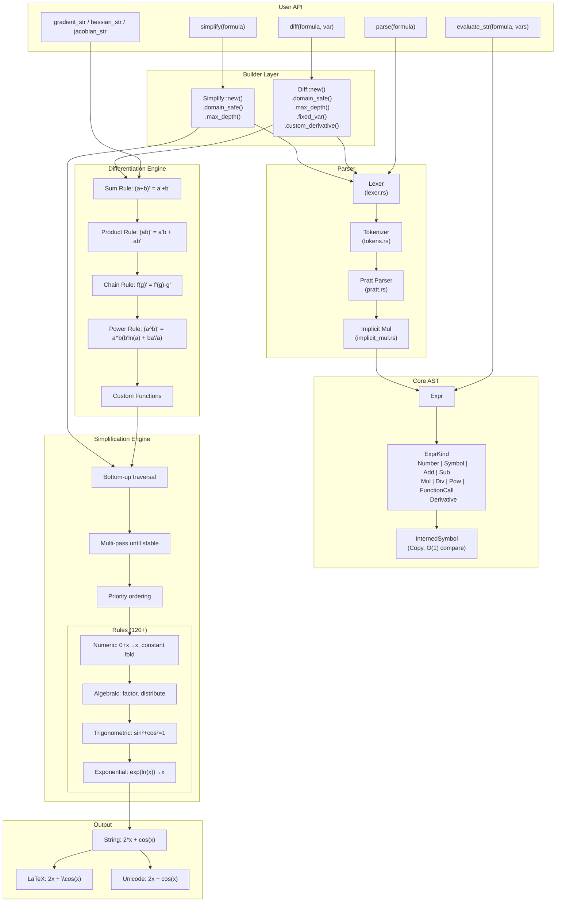
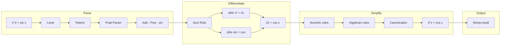

# SymbAnaFis Architecture

This document describes the internal architecture of SymbAnaFis, a high-performance symbolic mathematics library.

## Overview



### Data Flow: `diff("x^2 + sin(x)", "x")`



## Module Structure

```
src/
├── lib.rs                    # Public API: diff(), simplify(), re-exports
├── ast.rs                    # Expr, ExprKind - core expression types
├── symbol.rs                 # InternedSymbol, Symbol - Copy symbols
├── error.rs                  # DiffError, Span - error types
├── traits.rs                 # Numeric/trig traits
│
├── parser/                   # String → Expr
│   ├── mod.rs               # parse() function
│   ├── lexer.rs             # Tokenizer (30KB)
│   ├── tokens.rs            # Token definitions
│   ├── pratt.rs             # Pratt parsing algorithm
│   └── implicit_mul.rs      # 2x → 2*x handling
│
├── differentiation.rs        # Expr → Expr (symbolic differentiation)
│
├── simplification/           # Rule-based simplification
│   ├── mod.rs               # simplify_expr() entry point
│   ├── engine.rs            # Multi-pass engine
│   ├── helpers.rs           # Expression utilities
│   ├── README.md            # Rule documentation
│   ├── patterns/            # Pattern matching
│   └── rules/               # 120+ rules organized by category
│       ├── mod.rs           # Rule trait, priority system
│       ├── numeric/         # 0+x→x, constant folding
│       ├── algebraic/       # 9 files: factoring, power, terms, etc.
│       ├── trigonometric/   # 7 files: Pythagorean, double angle, etc.
│       ├── hyperbolic/      # 5 files: sinh/cosh identities
│       ├── exponential/     # exp/ln rules
│       └── root/            # sqrt/cbrt rules
│
├── builder.rs                # Diff, Simplify builders (fluent API)
│
├── functions/                # Built-in functions
│   ├── mod.rs               # Function registry
│   ├── definitions.rs       # 50+ function defs (41KB)
│   └── registry.rs          # Name → Function lookup
│
├── math/                     # Numeric implementations
│   └── dual.rs              # Dual numbers for auto-diff
│
├── helpers.rs                # Higher-level: gradient, hessian, jacobian
├── uncertainty.rs            # Uncertainty propagation
├── display.rs                # to_string(), to_latex(), to_unicode()
├── visitor.rs                # AST visitor pattern
│
├── parallel.rs               # (optional) Parallel batch evaluation
├── python.rs                 # (optional) PyO3 bindings
│
└── tests/                    # 49 test files
```

### Key File Sizes

| File | Size | Purpose |
|------|------|---------|
| `functions/definitions.rs` | 41 KB | All built-in function derivatives/evaluations |
| `symbol.rs` | 30 KB | Complete symbol interning system |
| `parser/lexer.rs` | 30 KB | Tokenizer with edge case handling |
| `display.rs` | 29 KB | LaTeX/Unicode/String formatting |
| `differentiation.rs` | 32 KB | All differentiation rules |
| `simplification/helpers.rs` | 24 KB | Pattern matching utilities |
| `python.rs` | 23 KB | Full Python API bindings |

---

## Core Components

### 1. Expression AST (`ast.rs`)

The fundamental data structure is `Expr`, a tree-based AST using `Arc` for shared ownership.

```rust
pub struct Expr {
    pub kind: ExprKind,
}

pub enum ExprKind {
    Number(f64),
    Symbol(InternedSymbol),
    Add(Arc<Expr>, Arc<Expr>),
    Sub(Arc<Expr>, Arc<Expr>),
    Mul(Arc<Expr>, Arc<Expr>),
    Div(Arc<Expr>, Arc<Expr>),
    Pow(Arc<Expr>, Arc<Expr>),
    FunctionCall { name: String, args: Vec<Expr> },
    Derivative { inner: Arc<Expr>, var: String, order: u32 },
}
```

**Design decisions:**
- **`Arc<Expr>`** for sharing subexpressions (e.g., in `x + x`)
- **Binary operators** as separate variants (faster pattern matching than n-ary)
- **`Derivative`** variant for unevaluated partial derivatives

### 2. Symbol System (`symbol.rs`)

Symbols are **interned** for O(1) comparison and implement **`Copy`** for ergonomic usage.

```rust
#[derive(Copy, Clone)]
pub struct Symbol {
    id: InternedSymbol,  // Internal ID
}
```

**Key features:**
- `symb("x")` - Get or create symbol (idempotent)
- `symb_new("x")` - Create only (errors if exists)
- `symb_get("x")` - Get only (errors if not found)
- Registry is thread-local for safety

**Why Copy?** Enables natural operator usage: `x + x` works without `.clone()`.

### 3. Parser (`parser/`)

A **Pratt parser** (operator-precedence) with custom lexer supporting:

```
parser/
├── lexer.rs        # Tokenizes input (numbers, symbols, operators)
├── tokens.rs       # Token definitions
├── pratt.rs        # Pratt parsing algorithm
└── implicit_mul.rs # Handles implicit multiplication (2x, xy)
```

**Features:**
- Implicit multiplication: `2x` → `2 * x`, `xy` → `x * y`
- Scientific notation: `1e-5`, `2.5e3`
- Multi-character symbols: `sigma`, `alpha`
- Function calls: `sin(x)`, `besselj(0, x)`

**Parsing speed:** ~500-900 ns per expression (1.6-2.3x faster than Symbolica)

### 4. Differentiation (`differentiation.rs`)

Implements standard calculus rules:

| Rule | Implementation |
|------|----------------|
| Constant | d/dx[c] = 0 |
| Variable | d/dx[x] = 1 |
| Sum | d/dx[a + b] = a' + b' |
| Product | d/dx[a · b] = a'b + ab' |
| Quotient | d/dx[a/b] = (a'b - ab')/b² |
| Chain | d/dx[f(g)] = f'(g) · g' |
| Power | d/dx[a^b] = a^b · (b' ln(a) + b · a'/a) |

**Custom functions:**
```rust
Diff::new()
    .custom_derivative("f", |inner, _var, inner_prime| {
        // d/dx[f(u)] = 2u · u'
        Expr::number(2.0) * inner * inner_prime
    })
```

### 5. Simplification Engine (`simplification/`)

A **multi-pass, rule-based** simplification system.

```
simplification/
├── engine.rs       # Bottom-up tree traversal
├── helpers.rs      # Expression matching utilities
└── rules/          # 120+ categorized rules
    ├── numeric/    # Constant folding, 0+x→x
    ├── algebraic/  # Factoring, distribution, powers
    ├── trigonometric/  # sin²+cos²=1, double angles
    ├── hyperbolic/     # sinh/cosh identities
    ├── exponential/    # exp(ln(x))→x, log rules
    └── root/           # sqrt/cbrt simplification
```

**Priority ordering:** Expand → Cancel → Compact

| Priority | Phase | Purpose |
|----------|-------|---------|
| 85-95 | Expansion | Distribute, flatten |
| 70-84 | Cancellation | x^0→1, x/x→1 |
| 40-69 | Consolidation | Factor, combine terms |
| 1-39 | Canonicalization | Sort terms |

**Domain-safe mode:** Skips rules that alter domains (e.g., `sqrt(x²) → x`).

### 6. Builder Pattern (`builder.rs`)

Fluent API for configuration:

```rust
Diff::new()
    .domain_safe(true)      // Preserve domains
    .max_depth(200)         // AST depth limit
    .max_nodes(50000)       // Node count limit
    .fixed_var(&symb("a"))  // Treat as constant
    .custom_fn("f")         // Register function
    .diff_str("a*f(x)", "x")
```

Both `Diff` and `Simplify` builders share similar configuration.

---

## Data Flow

### `diff("x^2 + sin(x)", "x")`

```
1. PARSE
   "x^2 + sin(x)" → Expr::Add(Pow(x,2), sin(x))

2. DIFFERENTIATE
   d/dx[x² + sin(x)]
   = d/dx[x²] + d/dx[sin(x)]
   = 2x + cos(x)

3. SIMPLIFY (automatic)
   Multi-pass rule application
   Result: "2*x + cos(x)"

4. FORMAT
   Expr → String: "2*x + cos(x)"
```

---

## Special Features

### Vector Calculus (`helpers.rs`)

```rust
gradient_str("x^2 + y^2", &["x", "y"])?;  // ["2*x", "2*y"]
hessian_str("x^2*y", &["x", "y"])?;       // [["2*y", "2*x"], ["2*x", "0"]]
jacobian_str(&["x+y", "x*y"], &["x", "y"])?;
```

### Uncertainty Propagation (`uncertainty.rs`)

Implements the GUM formula: σ_f = √(Σᵢ Σⱼ (∂f/∂xᵢ)(∂f/∂xⱼ) Cov(xᵢ, xⱼ))

```rust
uncertainty_propagation(&expr, &["x", "y"], Some(&cov_matrix))?;
```

### Parallel Evaluation (`parallel.rs`, requires `parallel` feature)

Batch evaluation using Rayon:

```rust
eval_parallel!(
    [expr1, expr2],
    [["x"], ["x", "y"]],
    [[[1.0, 2.0]], [[1.0, 2.0], [3.0, 4.0]]]
)
```

### Python Bindings (`python.rs`, requires `python` feature)

PyO3 bindings exposing:
- `diff()`, `simplify()`, `parse()`
- `PyExpr` with operator overloading
- `PyDiff`, `PySimplify` builders

---

## Built-in Functions (`functions/`)

50+ functions with differentiation and evaluation rules:

| Category | Functions |
|----------|-----------|
| Trig | sin, cos, tan, cot, sec, csc + inverses |
| Hyperbolic | sinh, cosh, tanh + inverses |
| Exp/Log | exp, ln, log, log10, log2 |
| Special | gamma, digamma, polygamma, beta |
| Bessel | besselj, bessely, besseli, besselk |
| Error | erf, erfc |
| Other | zeta, LambertW, abs, sign |

---

## Performance Characteristics

| Operation | Time | Notes |
|-----------|------|-------|
| Parsing | 0.5-1 µs | Pratt parser, interned symbols |
| Differentiation + Simplify | 20-200 µs | Rule-based, multi-pass |
| Pure evaluation | 400-600 ns | Direct computation |
| Simplification only | 10-70 µs | Depends on expression complexity |

**Current limitation:** Polynomial operations use pattern-matching rules (slower than native polynomial arithmetic). See `ROADMAP_v0.3.1_POLY.md` for planned improvements.

---

## Extension Points

1. **Custom derivatives:** `Diff::new().custom_derivative("f", ...)`
2. **Custom evaluation:** `Diff::new().custom_eval("f", ...)`
3. **New simplification rules:** Add to `simplification/rules/`
4. **New functions:** Add to `functions/definitions.rs` and `registry.rs`
